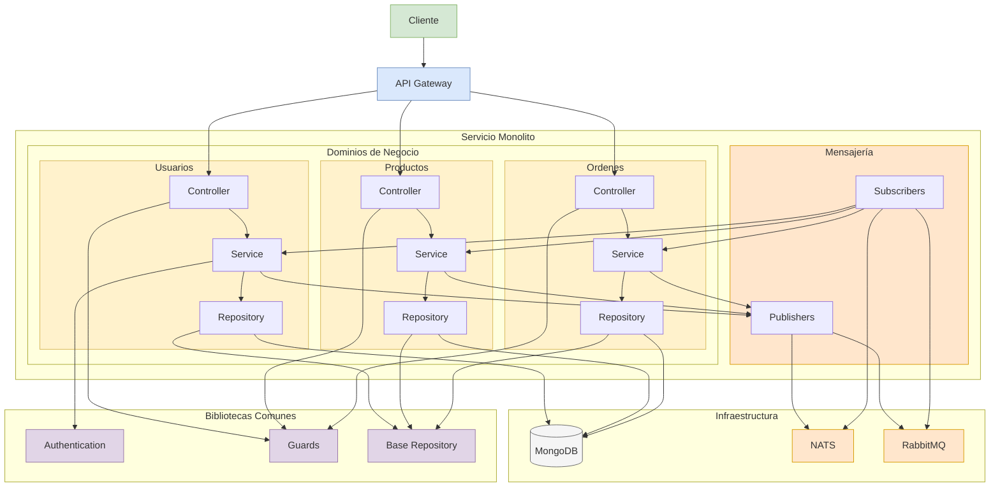

# NestJS DDD Microservices Ecosystem

Este proyecto implementa una arquitectura de microservicios utilizando NestJS con Domain-Driven Design (DDD), comunicación asíncrona a través de RabbitMQ y NATS, y persistencia de datos con MongoDB.

## Características Principales

- 🏗️ **Arquitectura DDD**: Organización limpia por dominios con capas bien definidas (aplicación, dominio, infraestructura)
- 🔐 **Autenticación JWT**: Sistema completo con tokens de acceso y refresco
- 👮 **Control de Acceso**: Protección de rutas basada en roles mediante guards
- 📄 **Paginación Avanzada**: Implementación genérica para consultas paginadas en MongoDB
- 📱 **API Gateway**: Enrutamiento centralizado y políticas de acceso
- 📨 **Mensajería Asíncrona**: Comunicación entre servicios mediante RabbitMQ y NATS
- 🧩 **Monorepo**: Organización modular con bibliotecas compartidas
- 📊 **Documentación Swagger**: API documentada automáticamente
- 🔍 **TypeScript Estricto**: Tipado completo para mayor seguridad
- 🛡️ **Middlewares de Seguridad**: Helmet, rate-limiting y compresión

## Arquitectura Modular



### ¿Cómo funciona esta arquitectura?

Esta arquitectura permite construir sistemas escalables y mantenibles siguiendo los principios de Domain-Driven Design (DDD). Te explico cómo fluye la información:

1. **Flujo de peticiones**: Cuando un cliente hace una petición, llega primero al API Gateway, que actúa como punto de entrada único al sistema. El Gateway enruta estas peticiones a los controladores adecuados dentro del monolito.

2. **Procesamiento interno**: Dentro del monolito, cada dominio (Usuarios, Productos, Órdenes) tiene su propia estructura de Controller-Service-Repository, lo que les permite operar de manera independiente.

3. **Comunicación asíncrona**: Cuando ocurre un evento importante (ej: "cliente registrado", "orden creada"), el servicio correspondiente utiliza los Publishers para enviar mensajes a través de los brokers (NATS y RabbitMQ).

4. **Reacción a eventos**: Los Subscribers escuchan estos mensajes y notifican a los servicios interesados. Por ejemplo, cuando se crea una nueva orden, el servicio de productos puede recibir una notificación para actualizar el inventario.

5. **Persistencia de datos**: Todos los repositorios almacenan datos en MongoDB, utilizando el patrón Base Repository para compartir funcionalidades comunes.

### Ventajas para escalar

Lo bueno de este enfoque es que nos permite escalar el sistema de varias formas:

- **Horizontalmente**: Podemos desplegar múltiples instancias del monolito o incluso separar los dominios en servicios independientes cuando sea necesario.

- **Por dominio**: Cuando un dominio crece en complejidad, podemos extraerlo como un microservicio propio sin afectar al resto del sistema, gracias a la comunicación asíncrona.

- **Por capa**: Si MongoDB se convierte en un cuello de botella, podemos introducir bases de datos especializadas por dominio o agregar capas de caché.

La arquitectura está diseñada para evolucionar gradualmente desde un monolito modular hacia microservicios, sin necesidad de una migración completa de golpe. Esto permite un enfoque pragmático donde podemos escalar solo lo que necesitamos cuando lo necesitamos.

## Requisitos

- Node.js 22+ (especificado en .nvmrc)
- MongoDB 6+
- RabbitMQ 3.9+
- NATS 2.8+
- Docker y Docker Compose

## Estructura del Proyecto

```text
ddd-backend-rabbitmq/
├── apps/
│   ├── api-gateway/          # API Gateway
│   │   └── src/              # Código fuente
│   │       ├── auth/         # Autenticación
│   │       ├── cache/        # Servicio de caché
│   │       └── common/       # Utilidades comunes
│   └── monolith/             # Servicio monolito
│       └── src/              # Código fuente
│           ├── messaging/    # Integración con mensajería (RabbitMQ, NATS)
│           ├── orders/       # Dominio de órdenes
│           ├── products/     # Dominio de productos
│           └── users/        # Dominio de usuarios
├── libs/                     # Bibliotecas compartidas
│   └── common/               # Utilidades comunes
│       └── src/              # Código fuente
│           ├── auth/         # Autenticación y autorización
│           ├── database/     # Acceso a base de datos y repositorios
│           └── interfaces/   # Interfaces y tipos compartidos
├── docker/                   # Configuración de Docker
└── docs/                     # Documentación adicional
```

## Configuración con Docker

### Entornos Disponibles

El proyecto está configurado para soportar múltiples entornos a través de archivos .env:

- `.env`: Configuración por defecto (producción)
- `.env.development`: Configuración para desarrollo
- `.env.localhost`: Configuración para desarrollo local

### Ejecución con Docker Compose

1. **Producción** (entorno por defecto):

   ```bash
   docker-compose up -d
   ```

2. **Desarrollo**:

   ```bash
   docker-compose --env-file .env.development up -d
   ```

3. **Local**:

   ```bash
   docker-compose --env-file .env.localhost up -d
   ```

### Servicios Disponibles

Cuando ejecutes Docker Compose, se iniciarán los siguientes servicios:

- **API Gateway**: http://localhost:3000 (Swagger: http://localhost:3000/docs)
- **Monolith Service**: http://localhost:3001 (Swagger: http://localhost:3001/docs)
- **RabbitMQ Management**: http://localhost:15672 (Usuario: `rabbit_user`, Contraseña: `rabbit_password`)
- **MongoDB**: localhost:27017 (Usuario: `mongo_user`, Contraseña: `mongo_password`)
- **NATS**: localhost:4222 (Servidor de mensajería)

### Construcción Personalizada

Para construir las imágenes con configuraciones específicas:

```bash
docker-compose build --build-arg NODE_ENV=development
```

### Logs y Monitoreo

Para ver los logs de los servicios:

```bash
docker-compose logs -f [servicio]
```

Donde `[servicio]` puede ser: `api-gateway`, `monolith`, `rabbitmq`, `mongodb`, o `nats`.

## Instalación para Desarrollo Local

1. Clonar el repositorio:

   ```bash
   git clone https://github.com/tu-usuario/ddd-backend-rabbitmq.git
   cd ddd-backend-rabbitmq
   ```

2. Instalar dependencias:

   ```bash
   npm install
   ```

3. Levantar infraestructura con Docker:

   ```bash
   docker-compose --env-file .env.development up -d rabbitmq mongodb nats
   ```

4. Iniciar los servicios en modo desarrollo:

   ```bash
   npm run start:dev
   ```

   O inícialos por separado:

   ```bash
   npm run start:dev:api-gateway
   npm run start:dev:monolith
   ```

## Endpoints Principales

Consulta la documentación específica de cada API para detalles sobre los endpoints:

- [Autenticación API](./docs/auth-api.md)
- [Usuarios API](./docs/users-api.md)
- [Productos API](./docs/products-api.md)
- [Ordenes API](./docs/orders-api.md)

## Documentación API

La documentación Swagger está disponible en:

- API Gateway: `http://localhost:3000/docs`
- Monolito: `http://localhost:3001/docs`

## Patrones Implementados

- **Repository Pattern**: Abstracción de acceso a datos
- **Factory Pattern**: Creación de instancias complejas
- **Command Pattern**: Encapsulación de solicitudes
- **Observer Pattern**: Comunicación basada en eventos
- **Dependency Injection**: Inversión de control
- **Command Query Responsibility Segregation (CQRS)**: Separación de lecturas y escrituras

## Licencia

Este proyecto está licenciado bajo la Licencia MIT.
